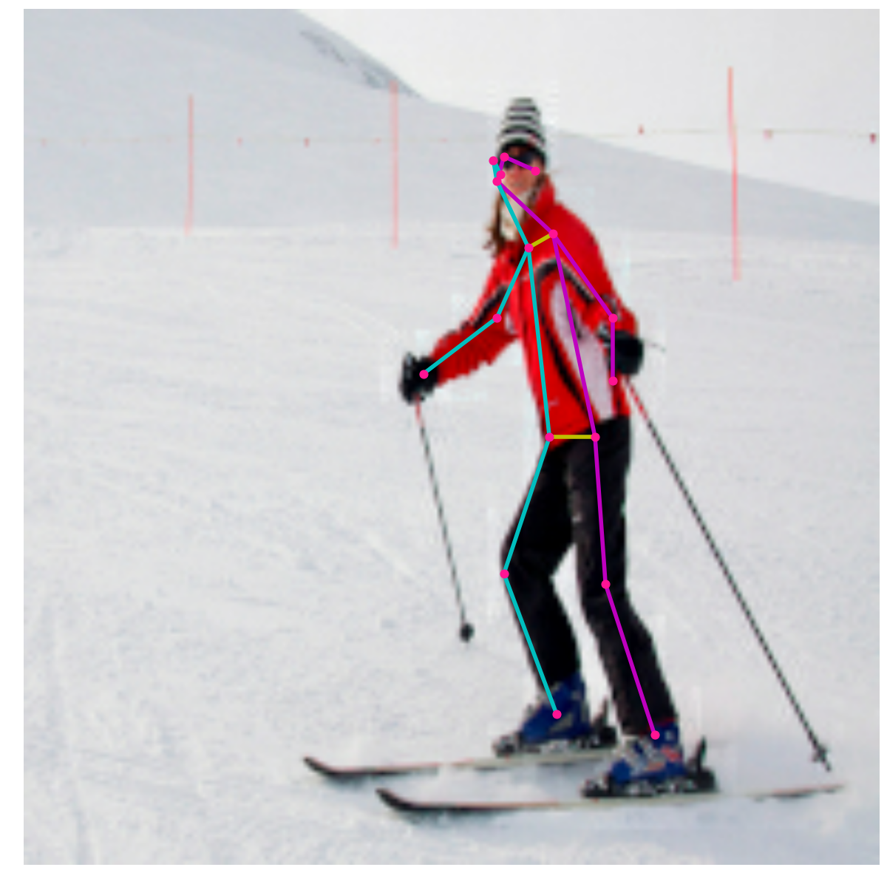

# MoveNet TFLite-micro

MoveNet is an ultra-fast and accurate pose detection model developed at Google that can detect 17 keypoints of a body. The model is available on [Kaggle](https://www.kaggle.com/models/google/movenet/) with two variants, known as Lightning and Thunder. Lightning is intended for latency-critical applications, while Thunder is intended for applications that require high accuracy.

TFLite-micro framework does not support data types of certain layers of MoveNet. This repository addresses this issue.

## Installation
### Requirements
1. [Bazel](https://bazel.build/install)
2. python3
3. python3-pip
4. Clone this repository
```git clone https://github.com/rahul-t-p/movenet-tflite-micro.git```
5. Install packages
```pip3 install -r requirements.txt```
6. Modify tflite-micro implementation to add support for MoveNet.
```git apply add_unsupported_ops.patch```
7. Build `tflite-micro` python package
```cd tflite-micro```
```bazel build //python/tflite_micro:whl.dist```
```
tree bazel-bin/python/tflite_micro/whl_dist/
bazel-bin/python/tflite_micro/whl_dist/
`-- tflite_micro-0.dev20231115234459-py3-none-any.whl

0 directories, 1 file
```
```pip3 install bazel-bin/python/tflite_micro/whl_dist/tflite_micro-0.dev20231115234459-py3-none-any.whl```

### Running Inference
```python3 inference.py```



Note: This repository was tested on Ubuntu 20.04

## References
1. [Run the function interpreter->AllocateTensors() unsuccess](https://github.com/espressif/esp-tflite-micro/issues/30)
2. [movenet](https://www.kaggle.com/models/google/movenet/)
3. [The tflite_micro Python Package](https://github.com/tensorflow/tflite-micro/blob/main/python/tflite_micro/README.md)
4. [MoveNet: Ultra fast and accurate pose detection model.](https://www.tensorflow.org/hub/tutorials/movenet)
